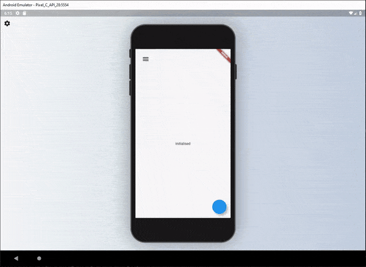

# Responsive Builder 💻➡️🖥➡️📱➡️⌚️

The responsive builder package contains widgets that allows you to create a readable responsive UI. The package is inspired by the [Responsive UI Flutter series](https://www.youtube.com/playlist?list=PLQQBiNtFxeyJbOkeKBe_JG36gm1V2629H) created by FilledStacks.

It aims to provide you with widgets that make it easy to build different UI's along two different Axis. Orientation x ScreenType. This means you can have a separate layout for Mobile - Landscape, Mobile - Portrait, Tablet - Landscape and Tablet-Portrait. 

If you follow along with the series you will have a complete understanding of how it's built and how to use it. [Part 2](https://youtu.be/udsysUj-X4w) goes over how we build the example included in this project.



## Installation

Add responsive_builder as dependency to your pubspec file.

```
responsive_builder:
```

## Usage

This package provides a widget called `ResponsiveBuilder` that provides you with a builder function that returns the current `SizingInformation`. The `SizingInformation` includes the `DeviceScreenType`, `screenSize` and `localWidgetSize`. This can be used for fine grained responsive control from a view level down to per widget responsive level.

### Responsive Builder

The `ResponsiveBuilder` is used as any other builder widget.

```dart
// import the package
import 'package:responsive_builder/responsive_builder.dart';

// Use the widget
ResponsiveBuilder(
    builder: (context, sizingInformation) {
      // Check the sizing information here and return your UI
          if (sizingInformation.deviceScreenType == DeviceScreenType.Desktop) {
          return Container(color:Colors.blue);
        }

        if (sizingInformation.deviceScreenType == DeviceScreenType.Tablet) {
          return Container(color:Colors.red);
        }

        if (sizingInformation.deviceScreenType == DeviceScreenType.Watch) {
          return Container(color:Colors.yellow);
        }

        return Container(color:Colors.purple);
      },
    },
  );
}
```

This will return different colour containers depending on which device it's being shown on. A simple way to test this is to either run your code on Flutter web and resize the window or add the [device_preview](https://pub.dev/packages/device_preview) package and view on different devices.

## Orientation Layout Builder

This widget can be seen as a duplicate of the `OrientationBuilder` that comes with Flutter, but the point of this library is to help you produce a readable responsive UI code base. As mentioned in the [follow along tutorial](https://youtu.be/udsysUj-X4w) I didn't want responsive code riddled with conditionals around orientation, `MediaQuery` or Renderbox sizes. That's why I created this builder.

The usage is easy. Provider a builder function that returns a UI for each of the orientations. 

```dart
// import the package
import 'package:responsive_builder/responsive_builder.dart';

// Return a widget function per orientation
OrientationLayoutBuilder(
  portrait: (context) => Container(color: Colors.green),
  landscape: (context) => Container(color: Colors.pink),
),
```

This will return a different coloured container when you swap orientations for your device. In a more readable manner than checking the orientation with a conditional.

## Screen Type Layout

This widget is similar to the Orientation Layout Builder in that it takes in Widgets that are named and displayed for different screen types. 

```dart
// import the package
import 'package:responsive_builder/responsive_builder.dart';

// Construct and pass in a widget per screen type
ScreenTypeLayout(
  mobile: Container(color:Colors.blue)
  tablet: Container(color: Colors.yellow),
  desktop: Container(color: Colors.red),
  watch: Container(color: Colors.purple),
);
```

To get a more in depth run through of this package I would highly recommend [watching this tutorial](https://youtu.be/udsysUj-X4w) where I show you how it was built and how to use it.

## Contribution

1. Fork it!
2. Create your feature branch: `git checkout -b my-new-feature`
3. Commit your changes: `git commit -am 'Add some feature'`
4. Push to the branch: `git push origin my-new-feature`
5. Submit a pull request.
